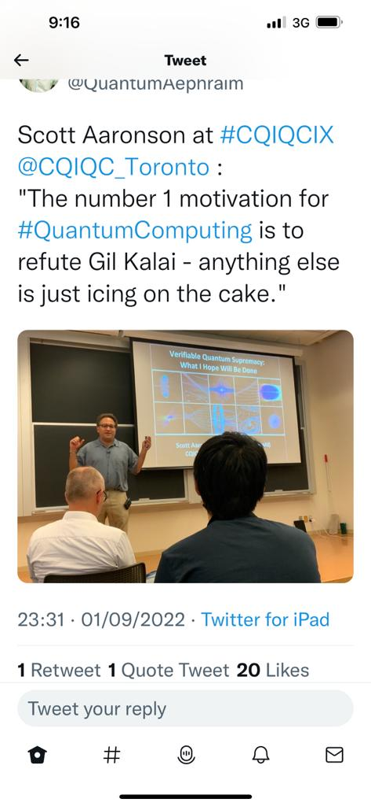

## Online Quantum Seminars

- [Virtual Seminar on Precision Physics and Fundamental Symmetries](https://indico.cern.ch/category/12183/) – an initiative for the precision physics and quantum information community, every Thursday
- [The “Virtual AMO Seminar”](https://www.amo-seminar.com): Fridays, 7pm (UTC)
- [The “Quantum Science Seminar”](http://quantumscienceseminar.com/): on Thursdays, 5 pm
- [Brookheaven Q Seminars](https://www.bnl.gov/compsci/quantum/qseminars.php) - Biweekly virtual seminars focused on quantum information topics are usually scheduled on Wednesdays at 12 p.m. All are welcome to join over Zoom.
- [University of Michigan - Quantum Science Seminars (Zoom)](https://ece.engin.umich.edu/events/all-seminars/quantum-science-seminar/)
- [Joint Quantum Institute (Zoom)](https://jqi.umd.edu/events)
- [QSE Quantum Seminar Series (EPFL)](https://www.epfl.ch/research/domains/quantum-center/center-for-quantum-science-and-engineering/events/qse-quantum-seminar-series/)
- [Qiskit quantum seminars](https://www.youtube.com/playlist?list=PLOFEBzvs-Vvr0uEoGFo08n4-WrM_8fft2)
- [NC State University - Quantum Seminars](https://quantum.ncsu.edu/quantum-seminars/)
- [Quantum Theory Seminar (Cornell)](https://quantumtheory.physics.cornell.edu/)
- [Quantum Matter Seminars NU](https://sites.google.com/view/quantum-matter-seminar/contact-us)
- [Quantum Information Seminar (Fields Institute)](http://www.fields.utoronto.ca/activities/seminars/quantum-information-seminar)
- [Quantum Meets @ IIIT](https://github.com/quantum-iiit/quantum-iiit.github.io/blob/main/content.md#quantum-meets--iiit) ([YouTube channel](https://www.youtube.com/@Quantum-Seminars/videos))

## News

- [Inside Quantum Technology](https://www.insidequantumtechnology.com/)
- [The Quantum Insider - Daily](https://thequantuminsider.com/category/daily/)
- [Quantum Computing Report - News](https://quantumcomputingreport.com/news/)
- [Phys.org - Quantum Physics](https://phys.org/physics-news/quantum-physics/)
- [Nature Physics](https://www.nature.com/nphys/)
- [Quanta Magazine - Physics](https://www.quantamagazine.org/physics/)
- [Physical Review Letters - Highlights](https://journals.aps.org/prl/highlights)

## Israel Quantum Seminars

- [HUJI](https://phys.huji.ac.il/calendar/upcoming/events/quantum-center-seminar)
- [Technion](https://quantum.technion.ac.il/events)
- [The Center for Quantum Science and Technology (Weizmann)](https://centers.weizmann.ac.il/quantum-science-technology/events)
- [AMOS Seminar (Weizmann)](https://www.weizmann.ac.il/AMOS/seminars)
- [WIS-Q Seminar](https://www.weizmann.ac.il/complex/arnon/wis-q-seminar)
- [TAU](https://quantum.tau.ac.il/seminar-quantum-computing-July-7-2021_1950)

## Other Resources

A curated list of resources can be found here:
- [Awesome Quantum Computing](https://github.com/desireevl/awesome-quantum-computing)
- [Quantum Open Source Foundation - Learning Resources on Quantum Computing](https://www.qosf.org/learn_quantum/)
- [IonQ Quantum Resources](https://ionq.com/resources)

## Lecture Notes and Courses
- [John Watrous — Understanding Quantum Information and Computation: A Course on the Theory of Quantum Computing (arXiv:2507.11536)](https://arxiv.org/abs/2507.11536) — [PDF](https://arxiv.org/pdf/2507.11536) — [YouTube lecture series (follows this book)](https://youtube.com/playlist?list=PLOFEBzvs-VvqKKMXX4vbi4EB1uaErFMSO&si=OunACJUdcOOu6MTz)
- [John Watrous — The Theory of Quantum Information](https://cs.uwaterloo.ca/~watrous/TQI/)
- [Quantum Computing: Lecture Notes by Ronald de Wolf](https://arxiv.org/abs/1907.09415) — Master's-level lecture notes covering quantum computation, main algorithms, complexity, and error correction.
- [Joseph Avron - Quantum Information](https://phsites.technion.ac.il/avron/wp-content/uploads/sites/3/2021/07/Quantum_information_116031.pdf)
- [J. Preskill - Ph219/CS219 Lecture Notes](http://theory.caltech.edu/~preskill/ph219/index.html#lecture)
- [S. Aaronson - Quantum Computing since Democritus](https://www.scottaaronson.com/democritus/) (Cambridge University Press, 2013)
- [Andrew Childs — Lecture Notes on Quantum Algorithms](https://www.cs.umd.edu/~amchilds/qa/) — comprehensive graduate-level notes on quantum algorithms (quantum walks, phase estimation, Hamiltonian simulation, HHL, and more)
- [Lecture notes! Intro to Quantum Information Science](https://scottaaronson.blog/?p=3943)
 - [Umesh Vazirani — Quantum Computing (Berkeley)](https://people.eecs.berkeley.edu/~vazirani/quantum.html) — course page with lecture notes and materials covering foundations of quantum computation, algorithms, and complexity
- [Open Course by MIT](https://ocw.mit.edu/courses/mas-865j-quantum-information-science-spring-2006/pages/lecture-notes/)
- [Open Course by Keio University](https://www.futurelearn.com/courses/intro-to-quantum-computing)
- [Professor Ryan O'Donnell Lectures on Quantum Computation and Information](https://www.youtube.com/@RyanODonnellTeaching/playlists)
- [Introduction to Quantum Information Science - Artur Ekert](https://www.arturekert.org/iqis) - [Qubit Guide](https://qubit.guide/index)
- [Nathan Wiebe - Quantum Computing Lectures](https://www.youtube.com/@nathanwiebe5305/videos)
- [Center for Quantum Information and Control - Courses](https://cquic.unm.edu/courses/index.html)

## Books

- **Nielsen, Michael A., and Isaac L. Chuang.** *Quantum Computation and Quantum Information.*
- **Mermin, N. David.** *Quantum Computer Science: An Introduction.*
- **Berman, Gennady P., Gary D. Doolen, Ronnie Mainieri, and Vladimir I. Tsifrinovich.** *Introduction To Quantum Computers.*
- **Bellac, Michel.** *A Short Introduction to Quantum Information and Quantum Computation.*
- **Chuang, Isaac, and Michael Nielsen.** *Quantum Computation and Quantum Information.*
- **Kaye, P., R. Laflamme, and M. Mosca.** *An Introduction to Quantum Computing.* Oxford University Press, 2007.

## Quantum Blogs

- [Quantum Country](https://quantum.country/)
- [John Preskill's Blog](https://quantumfrontiers.com/author/preskill/)
- [Vlatko Vedral's Blog](https://www.vlatkovedral.com/blog/)
- [Preposterous Universe](https://www.preposterousuniverse.com/blog/)
- [Shtetl-Optimized by Scott Aaronson](https://scottaaronson.blog/)
- [Backreaction](https://backreaction.blogspot.com/)
- [Quantum Frontiers](https://quantumfrontiers.com/)
- [Scott Aaronson on American Scientist](https://www.americanscientist.org/author/scott_aaronson)
- [QuBytes - paper summaries by strudents](https://qubytes.org/)

### Quantum Industry Blogs

- [IBM Quantum](https://www.ibm.com/quantum/blog)
- [QuEra](https://www.quera.com/blog)
- [Quantum Machines](https://www.quantum-machines.co/blog/)
- [AWS Quantum Computing](https://aws.amazon.com/blogs/quantum-computing/)
- [Azure Quantum](https://azure.microsoft.com/en-us/blog/quantum/)
- [IonQ](https://ionq.com/blog)
- [Q-CTRL](https://q-ctrl.com/blog)
- [Zapata Computing](https://zapata.ai/blog/)

## Quantum Coding

- [Quantum Error Correction: Shor Code in Qiskit](https://quantumcomputinguk.org/tutorials/quantum-error-correction-shor-code-in-qiskit)
- [Quantum Error Correction: Phase Flip Code in Qiskit](https://quantumcomputinguk.org/tutorials/quantum-error-correction-phase-flip-code-in-qiskit)
- [Trapped ion simulator](https://www.ionsim.org/)

## Open Source Quantum
- [Open Quantum](https://docs.open-quantum.org/)

## Why Quantum Computing?
